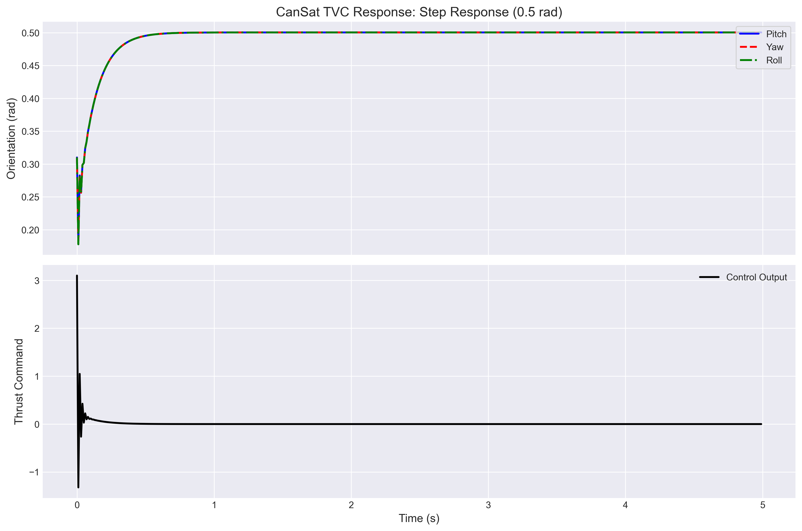
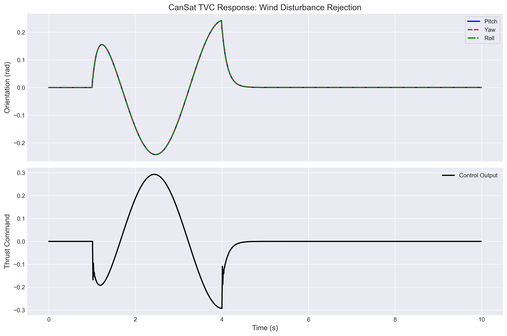

# CanSat TVC PID Controller Simulation  
[](https://www.python.org/downloads/)
[](https://opensource.org/licenses/MIT)  

A Python-based implementation of a PID controller for stabilizing a CanSat's orientation (pitch, yaw, roll) during descent using Thrust Vector Control (TVC).  

<div align="center">
  
  
</div>

## 📄 Project Report

[Click here to view the full PDF report](./report/report.pdf)


## Project Overview  
This project fulfills the requirements of the recruitment task to design and simulate a PID-controlled TVC system for CanSat orientation stabilization. While the original task specified MATLAB Simulink, this implementation uses Python for:  
- **System Dynamics Modeling**  
- **PID Controller Design**  
- **Disturbance Response Simulation**  
- **Performance Analysis**  


## Task Compliance  
| Original Requirement | Python Implementation |  
|----------------------|-----------------------|  
| Simulink Model | Modular OOP Code (`simulation.py`, `system_dynamics.py`) |  
| PID Controller | Custom `PIDController` Class |  
| IMU Feedback | Simulated Orientation Feedback Loop |  
| Step/Wind Response | Automated Test Scenarios |  
| Graphs & Report | Matplotlib Plots + LaTeX Report |  


## Installation

### Prerequisites
- Python 3.9+
- [Anaconda](https://www.anaconda.com/products/distribution)


### Create conda environment
```bash
conda create -n cansat python=3.9
conda activate cansat
```

### Install dependencies
```bash
pip install -r code/requirements.txt
```
### Clone Repository
```bash
git clone https://github.com/Monjurul-Hasan-Sohan/cansat-tvc-simulation.git
```

### Quick Start  
```bash
python code/run_simulations.py
```
